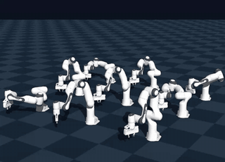
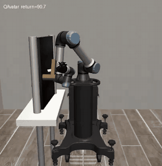
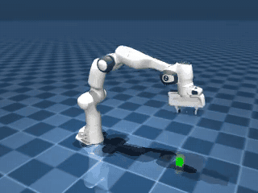
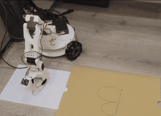
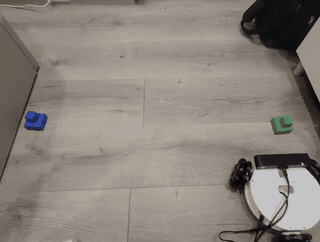

# AUP Teaching Labs

[English](README.md) | [繁體中文](README.zh-TW.md)

**Hands-on Modern AI and Physical AI courses accelerated by AMD GPUs.**

This repository brings together popular Deep Learning, Computer Vision, LLM,
and Physical AI topics as runnable notebooks. The course content is validated
on AMD hardware and includes straightforward Docker environments where
applicable.

## Physical AI

The Physical AI curriculum forms a complete learning path from physical simulation
to embodied intelligence and deployment:

<table>
  <thead>
    <tr>
      <th>Track</th>
      <th>Course</th>
      <th>What you will build</th>
      <th>Demo</th>
    </tr>
  </thead>
  <tbody>
    <tr>
      <td rowspan="3"><strong>Physical Simulation</strong></td>
      <td><a href="projects/Physical-AI/Physical-Simulation/Genesis-Simulation/">Genesis Simulation</a></td>
      <td>Load and control a Franka Panda, tune PD controllers, solve inverse kinematics, execute pick-and-place, and scale to parallel GPU environments.</td>
      <td></td>
    </tr>
    <tr>
      <td><a href="projects/Physical-AI/Physical-Simulation/Mujoco-Simulation/mujoco-torch/">MuJoCo + PyTorch</a></td>
      <td>Build Gymnasium environments, collect demonstrations, train behavior cloning and PPO policies, fine-tune SmolVLA, and explore cross-domain reinforcement learning.</td>
      <td></td>
    </tr>
    <tr>
      <td><a href="projects/Physical-AI/Physical-Simulation/Mujoco-Simulation/mujoco-MJX/">MuJoCo MJX</a></td>
      <td>Learn MJCF, robot control, and inverse kinematics before scaling to JIT-compiled parallel rollouts, domain randomization, and Playground PPO.</td>
      <td></td>
    </tr>
    <tr>
      <td rowspan="2"><strong>Real Deployment</strong></td>
      <td><a href="projects/Physical-AI/Real-Deployment/Robot-Policy-Deployment/">Robot Policy Deployment</a></td>
      <td>Teleoperate a real SO-101 arm, record a LeRobot dataset, train ACT from scratch, and fine-tune SmolVLA for autonomous manipulation.</td>
      <td></td>
    </tr>
    <tr>
      <td><a href="projects/Physical-AI/Real-Deployment/ROS2-Deployment/">ROS2 Deployment</a></td>
      <td>Build maps with stereo depth and RTAB-Map, explore autonomously, localize with Nav2, and drive a LeKiwi to task-specific goals.</td>
      <td></td>
    </tr>
  </tbody>
</table>

## More AI Courses

Physical AI is supported by a full progression through computer vision, deep
learning, and language models:

| Course | Journey |
|---|---|
| [**Computer Vision**](projects/CV/) | Image classification and ResNet → object detection → segmentation and SAM → tracking → VAE and diffusion models |
| [**Deep Learning**](projects/DL/) | PCA, SVM, clustering, and trees → neural networks and CNNs → Word2Vec, autoencoders, Seq2Seq, GANs, and Transformers |
| [**LLM from Scratch**](projects/LLM/) | Tensor fundamentals and autograd → tokenization and attention → FlashAttention, MoE, LoRA, training, KV cache, and a Tiny LLaMA capstone |

## Start Learning

The labs can be run locally using the provided notebooks and environment
instructions. Selected courses also integrate with
[AUP Learning Cloud](https://github.com/AMDResearch/aup-learning-cloud), which
provides pre-built Jupyter environments with AMD GPU acceleration through ROCm.

- Browse the hosted course portal:
  [amdresearch.github.io/aup-teaching-labs](https://amdresearch.github.io/aup-teaching-labs/)
- Learn about the cloud platform:
  [AUP Learning Cloud documentation](https://amdresearch.github.io/aup-learning-cloud/)

## Acknowledgments

AUP would like to thank the following universities, professors, and labs. This
teaching content was made possible through the joint efforts of these partners.

| University | Professors and Labs | Course Contributions |
|---|---|---|
| National Taiwan University | [Prof. Chun-Yi Lee](https://www.csie.ntu.edu.tw/en/member/Faculty/Chun-Yi-Lee-67240464), [ELSA Lab](https://elsalab.ai/) | DL, CV |
| Nanjing University | [Prof. Jingwei Xu](https://njudeepengine.github.io/jingweixu/), [NJUDeepEngine](https://github.com/NJUDeepEngine) | LLM |
| National Yang Ming Chiao Tung University | [Prof. Ping-Chun Hsieh](https://pinghsieh.github.io/), [Reinforcement Learning and Bandits Lab](https://pinghsieh.github.io/group.html) | Physical AI, Reinforcement Learning on MuJoCo |

We also thank the open-source projects that make these labs possible,
including [Genesis](https://github.com/Genesis-Embodied-AI/Genesis) and
[MuJoCo](https://github.com/google-deepmind/mujoco).

## License

Lab notebooks retain the copyright and license terms from their source
projects. See individual notebooks and project folders for details.

---

Copyright (C) 2026 Advanced Micro Devices, Inc. All rights reserved. Portions
of this file consist of AI-generated content.
SPDX-License-Identifier: MIT
