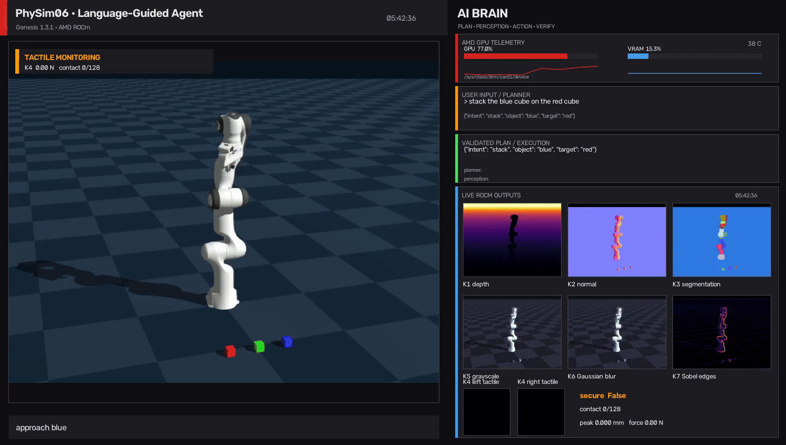

# AUP Teaching Labs

[English](README.md) | [中文](README.zh-TW.md)

**以 AMD GPU 加速的現代 AI 與實體 AI 實作課程。**

本專案將人工智慧導論、深度學習、電腦視覺、大型語言模型與實體 AI 等熱門主題整理成可直接執行的 Jupyter notebooks。所有課程內容皆於 AMD 硬體上完成驗證，並在適用的課程中提供易於使用的 Docker 環境。

## 實體 AI

實體 AI 課程提供一條從物理模擬、具身智慧到真實機器人部署的完整學習路徑：

<table>
  <thead>
    <tr>
      <th>類別</th>
      <th>課程</th>
      <th>實作內容</th>
      <th>示範</th>
    </tr>
  </thead>
  <tbody>
    <tr>
      <td rowspan="3"><strong>物理模擬</strong></td>
      <td><a href="projects/Physical-AI/Physical-Simulation/Genesis-Simulation/">Genesis Simulation</a></td>
      <td>從 Franka 控制、逆向運動學與 GPU 平行模擬，進階至 ROCm 視覺與觸覺感知，最後建立具備互動式即時 HUD、可重現場景配置與安全驗證流程的語言引導代理。</td>
      <td></td>
    </tr>
    <tr>
      <td><a href="projects/Physical-AI/Physical-Simulation/Mujoco-Simulation/mujoco-torch/">MuJoCo + PyTorch</a></td>
      <td>建立 Gymnasium 環境、收集示範資料、訓練行為克隆與 PPO 策略、微調 SmolVLA，並探索跨領域強化學習。</td>
      <td></td>
    </tr>
    <tr>
      <td><a href="projects/Physical-AI/Physical-Simulation/Mujoco-Simulation/mujoco-MJX/">MuJoCo MJX</a></td>
      <td>從 MJCF、機器人控制與逆向運動學開始，進一步實作 JIT 平行 rollouts、domain randomization 與 Playground PPO。</td>
      <td></td>
    </tr>
    <tr>
      <td rowspan="2"><strong>真實部署</strong></td>
      <td><a href="projects/Physical-AI/Real-Deployment/Robot-Policy-Deployment/">Robot Policy Deployment</a></td>
      <td>遙控真實 SO-101 機械手臂、錄製 LeRobot dataset、從零訓練 ACT，並微調 SmolVLA 以執行自主操作。</td>
      <td></td>
    </tr>
    <tr>
      <td><a href="projects/Physical-AI/Real-Deployment/ROS2-Deployment/">ROS2 Deployment</a></td>
      <td>使用 stereo depth 與 RTAB-Map 建立地圖、進行自主探索、透過 Nav2 定位，並讓 LeKiwi 完成指定目標。</td>
      <td></td>
    </tr>
  </tbody>
</table>

## 更多 AI 課程

除了實體 AI，本專案也提供人工智慧導論、電腦視覺、深度學習與大型語言模型的完整學習路徑：

| 課程 | 學習路徑 |
|---|---|
| [**人工智慧導論**](projects/Introduction-to-Artificial-Intelligence/) | 本地語言模型故事續寫 → 智慧代理迴圈與工具使用 → 姿態驅動互動 → 擴散模型圖像生成 |
| [**Computer Vision**](projects/CV/) | 影像分類與 ResNet → 物件偵測 → 影像分割與 SAM → 多物件追蹤 → VAE 與擴散模型 |
| [**Deep Learning**](projects/DL/) | PCA、SVM、分群與決策樹 → 神經網路與 CNN → Word2Vec、自編碼器、Seq2Seq、GAN 與 Transformer |
| [**從零打造大型語言模型**](projects/LLM/) | Tensor 與自動微分 → Tokenization 與 Attention → FlashAttention、MoE、LoRA、訓練、KV Cache 與 Tiny LLaMA |

## 開始學習

你可以使用本專案提供的 notebooks 與環境說明在本機執行課程。部分課程亦可與 [AUP Learning Cloud](https://github.com/AMDResearch/aup-learning-cloud) 整合，使用預先建置且支援 AMD GPU 與 ROCm 的 Jupyter 環境。

- 瀏覽線上課程入口：[amdresearch.github.io/aup-teaching-labs](https://amdresearch.github.io/aup-teaching-labs/)
- 了解雲端平台：[AUP Learning Cloud 文件](https://amdresearch.github.io/aup-learning-cloud/)

## 致謝

AUP 感謝以下大學、教授與實驗室的共同投入，讓這些教學內容得以完成。

| 大學 | 教授與實驗室 | 課程貢獻 |
|---|---|---|
| 國立臺灣大學 | [李濬屹教授](https://www.csie.ntu.edu.tw/en/member/Faculty/Chun-Yi-Lee-67240464)、[ELSA Lab](https://elsalab.ai/) | DL、CV |
| 南京大學 | [徐经纬教授](https://njudeepengine.github.io/jingweixu/)、[NJUDeepEngine](https://github.com/NJUDeepEngine) | LLM |
| 國立陽明交通大學 | [謝秉均教授](https://pinghsieh.github.io/)、[Reinforcement Learning and Bandits Lab](https://pinghsieh.github.io/group.html) | 實體 AI、MuJoCo 強化學習 |

我們也感謝 AMD AECG 團隊提供部分實體 AI 教學素材，以及支援這些課程的開源專案，包括 [Genesis](https://github.com/Genesis-Embodied-AI/Genesis) 與 [MuJoCo](https://github.com/google-deepmind/mujoco)。各項素材的詳細來源說明與原始 repository 連結，皆附於相關 notebook 中。

## 授權

各課程 notebook 保留其來源專案的著作權與授權條款，詳細資訊請參閱個別 notebook 與專案目錄。

---

Copyright (C) 2026 Advanced Micro Devices, Inc. All rights reserved. Portions
of this file consist of AI-generated content.
SPDX-License-Identifier: MIT
